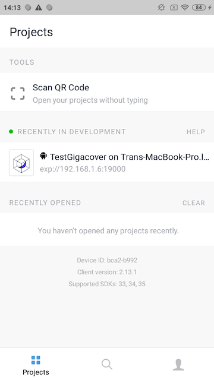

# react-native-assignment
React Native Trip App, using Expo v35, react-navigation v4.0.10, react-redux v7.1.3 and axios v0.19.0

This app runs on Expo v35.0.0 and React native v0.59. App's features:

* Pull to refresh trips
* View trip's details

Setup Expo v35:

[Installation link](https://docs.expo.io/versions/v35.0.0/get-started/installation/
)

Setup project:
```
git clone https://github.com/datvp09/react-native-assignment.git

cd react-native-assignment && npm install

expo start
```

Expo server will now turn on like below


Install Expo app on device


Click Scan QR Code on Expo app



To test app using Jest run:
```
cd react-native-assignment

npm run test
```
